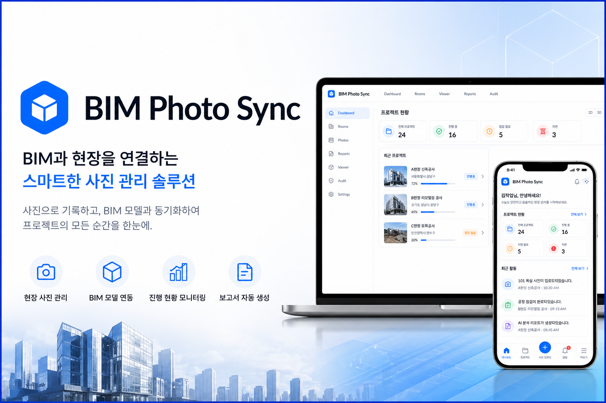
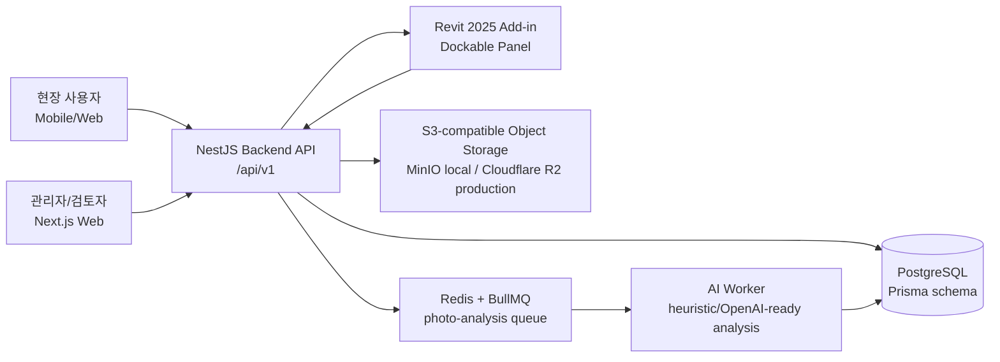
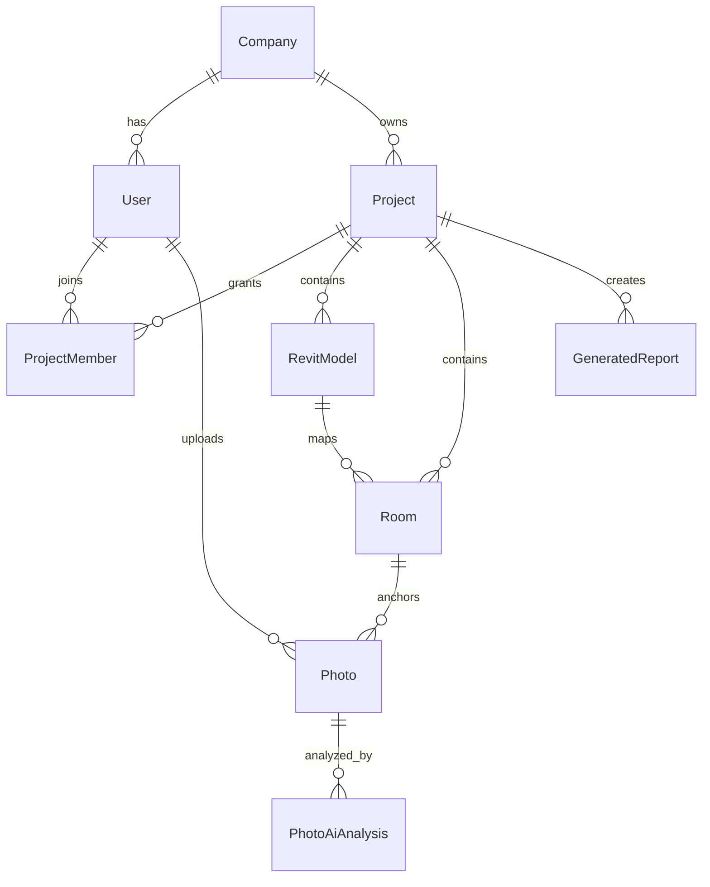
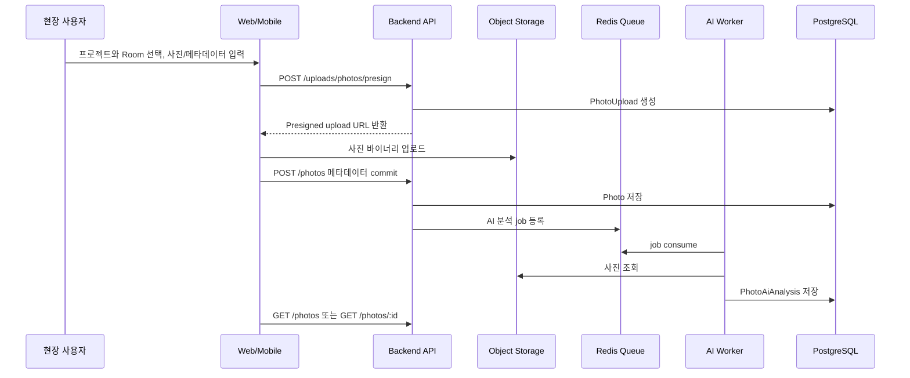
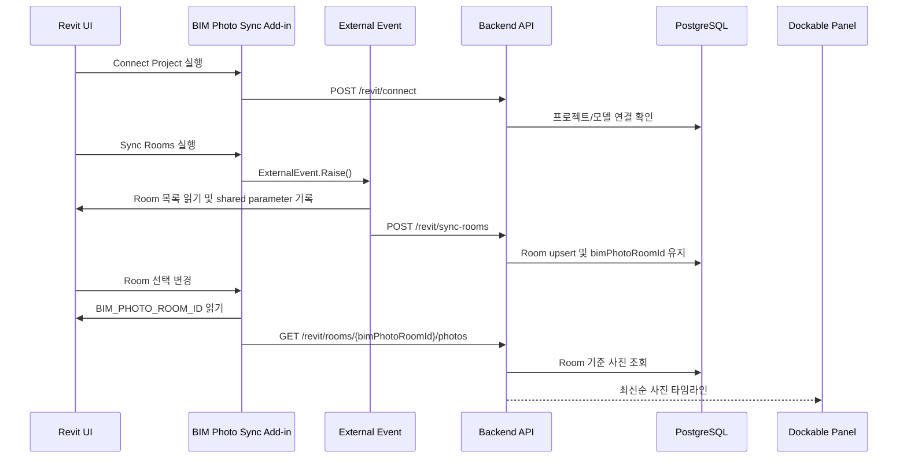
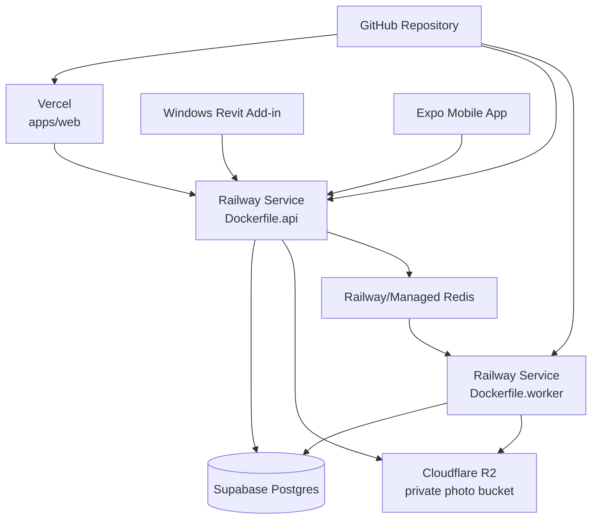

# BIM Photo Sync



BIM Photo Sync는 Revit Room을 기준 객체로 삼아 현장 사진, 작업 메모, AI 분석 결과를 프로젝트 단위로 연결하는 BIM 기반 현장 사진 관리 플랫폼입니다. 현장에 없던 사람도 웹, 모바일 앱, Revit Add-in에서 특정 실의 시공 상태를 시간순으로 확인할 수 있게 만드는 것이 핵심 목적입니다.

## 현재 MVP 범위

- 회사 단위 사용자 인증, 프로젝트, 프로젝트 접근 권한 구조
- Revit Room과 플랫폼 Room의 안정적인 ID 기반 매핑
- 프로젝트, 실, 공사면, 공종, 작업일자, 작업자, 설명 기반 사진 업로드와 조회
- Presigned URL 기반 비공개 Object Storage 업로드
- Queue 기반 AI 분석 worker와 분석 결과 저장
- Revit 2025 Add-in에서 프로젝트 연결, Room Sync, floor plan 동기화, Room 선택 시 사진 타임라인 조회
- Next.js 웹 콘솔, Expo 모바일 앱, NestJS API, BullMQ worker, Prisma/PostgreSQL 데이터 모델

현재 범위에서 APS Viewer, Dynamo graph 실행, 고급 AI 진단, 공정 색상 오버레이, HWP/PDF 완성 리포트 자동 생성은 구현 대상이 아닙니다. 리포트 데이터 모델과 화면의 기반은 존재하지만, 본격적인 문서 산출 파이프라인은 후속 범위입니다.

## 웹 콘솔 동작 범위

- 로그인 후 좌측 내비게이션으로 Dashboard, Projects, Rooms, Photos, Viewer, Reports, Audit, Settings에 접근합니다.
- Projects에서 프로젝트 생성, 참여, 접근키 생성을 수행합니다. 상위 관리자 계정은 Revit Add-in에서 프로젝트를 선택하고 Room/Floor Plan sync를 실행하는 방식으로 Revit 프로젝트를 등록합니다.
- Photos에서 프로젝트와 Room을 선택하고 사진 파일, 공사면, 공종, 작업일자, 작업자, 내용을 입력해 업로드합니다. 작업자 기본값은 로그인 사용자 이름입니다.
- Photos의 전체보기, 필터 적용, Room 선택 링크는 실제 API 조회를 수행합니다.
- Rooms에서 실제 API Room 목록을 검색, 새로고침, CSV 내보내기, Room 선택, 해당 Room 사진 보기, Viewer 이동으로 연결합니다. Room 동기화는 웹이 아니라 Revit Add-in에서 실행합니다.
- Viewer는 Revit Add-in이 동기화한 floor plan과 Room polygon을 조회하고, Room 선택 시 해당 Room 사진 API로 연결합니다.
- Reports는 `POST /reports/generate`, `GET /reports`, `GET /reports/:reportId` 기반으로 초안 데이터를 생성/조회합니다. PDF/HWP/DOCX 산출은 후속 범위입니다.

## 핵심 원칙

- Room이 시스템의 기준 객체입니다.
- PostgreSQL이 source of truth입니다.
- Revit은 BIM authoring tool이며 운영 데이터베이스가 아닙니다.
- Room 매핑은 이름이 아니라 `BIM_PHOTO_ROOM_ID`로 수행합니다.
- Revit 모델 수정은 External Event를 통해서만 수행합니다.
- Revit Add-in UI는 Dockable Panel을 사용합니다.
- 사진 원본은 비공개 Object Storage에 저장하고, DB에는 메타데이터와 object key를 저장합니다.

## 전체 시스템 그림



## 데이터 모델 요약



가장 중요한 연결은 `Project -> Room -> Photo -> PhotoAiAnalysis`입니다. Revit Room에는 공유 파라미터 `BIM_PHOTO_ROOM_ID`만 기록하고, 실제 사진/분석/검토 데이터는 백엔드 DB가 관리합니다.

## 주요 데이터 흐름



## Revit Add-in 구현 흐름



Add-in은 `revit-addin/BimPhotoSyncAddin`에 있으며 .NET 8 WPF 기반입니다. `BimPhotoSyncApp`이 ribbon, Dockable Pane, External Event, selection changed handler를 등록합니다. `PhotoDockPane`은 Room 선택 결과를 받아 사진 타임라인과 AI 요약을 표시합니다.

## Dynamo 사용 여부와 비교

현재 구현은 Dynamo를 사용하지 않습니다. Autodesk 공식 문서 기준으로 Dynamo는 Revit 안에서 graph를 만들어 반복 작업과 모델링/문서화 자동화를 줄이는 도구입니다. BIM Photo Sync는 지속 운영되는 웹/모바일/API/DB/스토리지/AI worker가 필요하므로 Add-in 중심 구조를 선택했습니다.

| 기준 | Revit Add-in 방식 | Dynamo 방식 |
| --- | --- | --- |
| 현재 채택 여부 | 채택 | 미채택 |
| 적합한 작업 | 상시 패널, 인증, API 통신, Room 선택 이벤트, 운영형 UI | 반복 모델링 자동화, 일회성 파라미터 정리, 사내 graph 배포 |
| 사용자 경험 | Revit ribbon과 Dockable Panel로 제품처럼 동작 | Dynamo 실행 환경과 graph 이해가 필요 |
| 백엔드 연동 | C# HttpClient와 설정 파일로 안정적 제어 | Python/노드 기반 HTTP 호출은 가능하지만 운영 UI에는 부적합 |
| 모델 쓰기 제어 | External Event와 Transaction으로 Revit API 규칙 준수 | graph 실행 시점 중심이라 상시 이벤트 처리에 약함 |
| 이 프로젝트에서의 역할 | Room sync와 사진 조회의 주 경로 | 후속 보조 도구 후보, 현재 README에는 구현으로 간주하지 않음 |

Dynamo를 후속 도구로 추가한다면 Room 파라미터 점검, 누락 Room 리포트, 모델 품질 검사처럼 Add-in의 운영 흐름을 보조하는 범위가 적절합니다.

## 서비스와 사용 사이트

| 사이트/서비스 | 현재 역할 | 동작 방식 |
| --- | --- | --- |
| GitHub | 소스 저장소, 브랜치/PR/이슈/코드리뷰 | 기능 브랜치에서 작업 후 PR로 main에 병합합니다. |
| Vercel | Next.js 웹 콘솔 배포 후보 | `apps/web`을 빌드하고 공개 웹 UI를 제공합니다. |
| Railway | NestJS API, AI worker, Redis/PostgreSQL 등 서버 배포 후보 | GitHub 또는 Dockerfile 기반 서비스 배포에 적합합니다. |
| Supabase | 운영 PostgreSQL 후보 | Prisma가 연결하는 canonical DB로 사용 가능합니다. Auth/Storage는 현재 자체 JWT/S3 흐름과 역할이 겹치므로 선택적으로만 사용합니다. |
| Cloudflare R2 | 운영 Object Storage 후보 | S3-compatible API로 presigned URL 업로드/다운로드를 처리합니다. |
| Google Gemini API | 리포트 생성 AI 후보 | `GEMINI_API_KEY`가 설정되면 reports service가 Gemini generateContent API를 호출할 수 있습니다. |
| MinIO | 로컬 Object Storage | `docker-compose.yml`에서 개발용 S3-compatible storage로 실행합니다. |
| Redis | 비동기 작업 큐 | BullMQ가 사진 AI 분석 job을 저장하고 worker가 처리합니다. |
| Autodesk Revit | BIM authoring 및 Room 기준 인터페이스 | Add-in이 Room ID를 쓰고 선택된 Room의 사진을 조회합니다. |
| Autodesk Dynamo | 자동화 보조 후보 | 현재 구현에는 포함되지 않습니다. |

## 배포/운영 구성 예시



로컬 개발에서는 Supabase/R2/Railway 대신 `docker-compose.yml`의 PostgreSQL, Redis, MinIO를 사용합니다. 운영에서는 PostgreSQL과 Object Storage를 관리형 서비스로 교체해도 API 계약은 유지됩니다.

## Repository Structure

```text
apps/api
  NestJS Backend API. 인증, 회사/프로젝트, Room, 업로드 presign, 사진 commit/조회,
  AI 분석 결과, Revit 연동 API를 담당합니다.

apps/ai-worker
  BullMQ worker. 업로드된 사진 분석 job을 처리하고 PhotoAiAnalysis를 저장합니다.

apps/web
  Next.js 웹 콘솔. 로그인, 대시보드, 프로젝트, Room, 사진, viewer, audit, report 화면을 제공합니다.

apps/mobile
  Expo React Native 현장 앱. 사진 선택/촬영, 메타데이터 입력, 업로드 흐름의 클라이언트 영역입니다.

packages/shared
  앱, 웹, API, worker가 함께 사용할 수 있는 TypeScript 공통 정의 영역입니다.

revit-addin/BimPhotoSyncAddin
  Revit 2025용 C#/.NET 8 WPF Add-in 코드입니다.

revit-addin/BimPhotoSync.addin
  Revit Add-in manifest입니다.

revit-addin/config.example.json
  Add-in 실행에 필요한 API URL, JWT, Project ID, Revit Model ID 설정 예시입니다.

.codex/agents
  awesome-codex-subagents에서 가져온 프로젝트 전용 Codex subagent TOML입니다.

.codex/external
  oh-my-codex와 awesome-codex-subagents 로컬 checkout 캐시입니다. Git에는 포함하지 않습니다.
```

## API 구조

모든 API는 `/api/v1` prefix를 사용합니다.

| Domain | Routes |
| --- | --- |
| Auth | `POST /auth/register`, `POST /auth/login`, `GET /auth/me` |
| Projects | `GET /projects`, `POST /projects`, `POST /projects/join`, `POST /projects/:projectId/access-key` |
| Rooms | `GET /projects/:projectId/rooms`, `POST /projects/:projectId/rooms`, `PATCH /rooms/:roomId` |
| Uploads | `POST /uploads/photos/presign` |
| Photos | `POST /photos`, `GET /photos`, `GET /photos/:photoId`, `GET /photos/:photoId/object` |
| AI | `GET /photos/:photoId/analysis`, `PATCH /photos/:photoId/analysis/review` |
| Revit | `POST /revit/connect`, `POST /revit/sync-rooms`, `POST /revit/floor-plans`, `GET /revit/projects/:projectId/floor-plans`, `GET /revit/rooms/:bimPhotoRoomId/photos` |
| Reports | `POST /reports/generate`, `GET /reports`, `GET /reports/:reportId` |

## 보안과 RLS 정책

현재 인증은 Supabase Auth가 아니라 NestJS 자체 JWT입니다. 회사/프로젝트/Room/사진 권한은 API 서비스 계층에서 `company_id`, project membership, role을 기준으로 검사합니다.

Supabase PostgreSQL은 직접 클라이언트 접근용이 아니라 서버 DB로 사용합니다. 따라서 RLS는 end-user policy가 아니라 안전장치로 적용합니다.

- `anon`, `authenticated` role은 앱 테이블 권한을 제거합니다.
- 앱 테이블에는 RLS를 활성화해 Supabase 클라이언트 키가 실수로 노출되어도 직접 조회/수정하지 못하게 합니다.
- Prisma/NestJS 서버 연결은 DB owner/server connection으로 유지합니다.
- Supabase Auth 기반 직접 테이블 접근으로 전환할 경우에는 `auth.uid()` 기반 회사/프로젝트 정책을 별도 migration으로 추가해야 합니다.

## 기술 스택과 선택 이유

| 영역 | 기술 | 선택 이유 |
| --- | --- | --- |
| Web | Next.js 15, React 18, TypeScript | Vercel 배포와 App Router metadata/OG 설정에 적합하고 운영 콘솔 개발 속도가 빠릅니다. |
| Mobile | Expo React Native | 현장 사진 촬영/선택 앱을 iOS/Android 공통 코드로 빠르게 구성할 수 있습니다. |
| API | NestJS, TypeScript | 모듈 경계가 명확하고 인증, DTO validation, 서비스 계층 분리에 적합합니다. |
| DB ORM | Prisma | PostgreSQL schema와 migration을 코드로 추적하기 쉽습니다. |
| DB | PostgreSQL | Room 중심 관계형 데이터, 권한, 조회 필터, 리포트 집계에 적합합니다. |
| Queue | Redis, BullMQ | 업로드 요청과 AI 분석을 분리해 API 응답성과 재시도 가능성을 확보합니다. |
| Storage | S3-compatible API, MinIO, Cloudflare R2 | 로컬/운영 환경을 같은 API로 연결하고 대용량 사진을 DB 밖에 저장합니다. |
| Revit Add-in | C# .NET 8, WPF, Revit API | Revit API와 UI 통합의 표준 경로이며 Dockable Panel과 External Event를 직접 사용할 수 있습니다. |
| AI Worker | Node.js worker | 사진 분석, 규칙 기반 요약, OpenAI 연동 후보를 API와 분리해 확장할 수 있습니다. |
| Reports AI | Google Gemini API optional | 보고서 초안 생성을 외부 LLM으로 확장할 수 있고, 미설정 시에도 구조화된 리포트 데이터를 유지합니다. |
| DevOps | Dockerfile.api, Dockerfile.worker, docker-compose | 로컬과 배포 환경의 실행 단위를 명확히 분리합니다. |

## 잠재 수요층

- 건설사 현장 관리자: 실별 시공 상태와 하자 근거 사진을 빠르게 추적해야 하는 팀
- CM/감리 조직: 특정 Room, 공종, 작업일자의 증빙 자료를 검토해야 하는 조직
- 설계/BIM 팀: Revit 모델과 현장 사진을 Room 기준으로 연결해 의사소통 비용을 줄이고 싶은 팀
- 협력업체 관리자: 공종별 작업 완료/보류 상태를 사진과 메모로 남겨야 하는 팀
- 발주처/운영사: 준공 전후 공간별 이력과 유지관리 근거 자료를 확보해야 하는 조직

## 활용 시나리오

| 시나리오 | 흐름 | 효과 |
| --- | --- | --- |
| 실별 공정 사진 관리 | 현장 작업자가 Room을 선택하고 사진/공종/공사면/메모를 업로드 | 사진 폴더명이나 메신저 검색 없이 Room 기준으로 추적합니다. |
| Revit 기반 검토 회의 | BIM 담당자가 Revit에서 Room을 클릭하고 Dockable Panel에서 최신 사진 확인 | 모델과 현장 사진 사이의 컨텍스트 전환을 줄입니다. |
| 하자/이슈 근거 확보 | 특정 Room의 작업일자별 사진과 AI 요약을 조회 | 원인 추적과 책임 구분을 위한 증빙을 빠르게 찾습니다. |
| 월간/주간 보고 준비 | 프로젝트, 공종, 기간 필터로 사진과 분석 내용을 모음 | 보고서 자동화의 입력 데이터를 구조화합니다. |
| 원격 현장 확인 | 본사/발주처가 웹 콘솔에서 Room별 최신 상태 확인 | 현장 방문 빈도와 커뮤니케이션 비용을 줄입니다. |

## 로컬 개발 시작

### 1. 의존성 설치

```powershell
npm install
```

### 2. 로컬 인프라 실행

```powershell
docker compose up -d
```

`docker-compose.yml`은 PostgreSQL `55432`, Redis `6379`, MinIO API `9000`, MinIO Console `9001`을 실행합니다.

### 3. 환경 변수 준비

```powershell
Copy-Item .env.example .env
```

필요 시 `.env`의 `DATABASE_URL`, `DIRECT_URL`, `REDIS_URL`, `S3_*`, `NEXT_PUBLIC_API_BASE_URL`, `EXPO_PUBLIC_API_BASE_URL`을 조정합니다.

### 4. Prisma 준비

```powershell
npm --workspace apps/api run prisma:generate
npm --workspace apps/api run prisma:migrate
```

### 5. 서비스 실행

```powershell
npm run dev:api
npm run dev:worker
npm run dev:web
```

웹은 기본적으로 `http://localhost:3000`을 사용합니다. `.env.example`의 API 기본값은 `http://localhost:4000/api/v1`이며, 현재 웹/모바일 코드에는 배포된 Railway API URL이 fallback으로 들어 있습니다. 로컬 개발 시에는 `NEXT_PUBLIC_API_BASE_URL`과 `EXPO_PUBLIC_API_BASE_URL`을 명시적으로 설정하는 편이 안전합니다.

## Revit Add-in 빌드와 설치

Windows에서 Revit 2025와 .NET 8 SDK가 필요합니다.

```powershell
$env:REVIT_2025_API = "C:\Program Files\Autodesk\Revit 2025"
dotnet build revit-addin\BimPhotoSyncAddin\BimPhotoSyncAddin.csproj -c Debug
```

설치 개요:

```powershell
New-Item -ItemType Directory -Force "$env:APPDATA\Autodesk\Revit\Addins\2025"
Copy-Item revit-addin\BimPhotoSyncAddin\bin\Debug\net8.0-windows\* "$env:APPDATA\Autodesk\Revit\Addins\2025" -Force
Copy-Item revit-addin\BimPhotoSync.addin "$env:APPDATA\Autodesk\Revit\Addins\2025\BimPhotoSync.addin" -Force
New-Item -ItemType Directory -Force "$env:APPDATA\BimPhotoSync"
Copy-Item revit-addin\config.example.json "$env:APPDATA\BimPhotoSync\config.json"
```

`config.json`에는 API base URL, JWT, Project ID, Revit Model ID를 넣습니다. Windows에서 백엔드가 다른 PC에서 실행 중이면 `localhost`가 아니라 해당 PC의 LAN IP를 사용해야 합니다.

## Revit 검증 기준

- Add-in이 Windows/Revit 2025에서 빌드됩니다.
- Revit 시작 시 BIM Photo Sync ribbon과 Dockable Panel이 로드됩니다.
- Connect Project가 API 연결과 인증을 통과합니다.
- Sync Rooms가 Revit Room에 `BIM_PHOTO_ROOM_ID`를 기록합니다.
- Room 선택 시 `GET /api/v1/revit/rooms/{bimPhotoRoomId}/photos`가 호출됩니다.
- 사진은 `workDate`, `takenAt`, `uploadedAt` 기준의 최신순 타임라인으로 표시됩니다.
- 사진이 없는 Room은 오류가 아니라 명확한 empty state를 표시합니다.
- Revit 모델 쓰기는 External Event 밖에서 발생하지 않습니다.

## 디자인 시스템

UI는 `designsystem.png`의 운영형 대시보드 방향을 따릅니다.

| Token | Value |
| --- | --- |
| Primary Blue | `#2563EB` |
| Blue Scale | `#EFF6FF`, `#CFE2FF`, `#99C2FF`, `#2563EB`, `#1D4ED8`, `#1E40AF`, `#0F172A` |
| Semantic | success `#22C55E`, warning `#F59E0B`, error `#EF4444`, info `#0EA5E9`, neutral `#6B7280` |
| Font | Pretendard fallback stack |
| Layout | 8px spacing grid, compact operational density |
| Components | 카드 radius 8px 이하, 마케팅 페이지보다 업무 도구 밀도 우선 |

## Agent 운영 규칙

이 저장소의 agent 지침은 `AGENTS.md`에 있습니다. 핵심 규칙은 다음과 같습니다.

- OMX는 `.codex/external/oh-my-codex`에 로컬 checkout으로 유지하고, 작업에 유용한 workflow/prompt/skill을 우선 검토합니다.
- `awesome-codex-subagents`의 136개 TOML subagent는 `.codex/agents`에 설치되어 있으며, 작업 성격에 맞는 최소 팀을 구성합니다.
- Revit/BIM/스토리지/배포/AI 관련 의사결정은 공식 문서, 논문, 성숙한 오픈소스를 먼저 확인합니다.
- Codex 작업 방식과 유사한 요청은 OpenAI 공식 Codex use cases를 확인하고, 해당되는 use case workflow를 참고합니다.
- 새 기능은 `codex/` prefix 브랜치에서 작업하고, 완료 후 README 갱신, 검증, 커밋, push, PR, merge, feature branch 삭제 흐름을 따릅니다.
- `README.md`가 canonical 문서입니다. 별도 문서는 사용자가 요청하지 않는 한 만들지 않습니다.

## OG 이미지

웹 OG 이미지는 `apps/web/public/OGimg.png`를 사용합니다. Next.js metadata는 `/OGimg.png`를 `1200x630` PNG로 선언하고, `NEXT_PUBLIC_SITE_URL`, `VERCEL_PROJECT_PRODUCTION_URL`, `VERCEL_URL` 순서로 `metadataBase`를 계산합니다. 파일은 링크 미리보기 표준 비율인 `1200x630`으로 맞추고, 원본 그래픽을 contain 방식으로 배치해 카카오톡, Slack, GitHub, X/Twitter 등에서 중앙 크롭되어도 핵심 텍스트와 제품 화면이 잘리지 않도록 관리합니다. 루트의 `OGimg.png`는 README 미리보기와 원본 관리용 동일 이미지입니다.

## 참고 자료

- [Autodesk Revit API External Events](https://help.autodesk.com/cloudhelp/2018/ENU/Revit-API/Revit_API_Developers_Guide/Advanced_Topics/External_Events.html)
- [Autodesk Revit API Parameters](https://help.autodesk.com/cloudhelp/2024/ENU/Revit-API/files/Revit_API_Developers_Guide/Basic_Interaction_with_Revit_Elements/Revit_API_Revit_API_Developers_Guide_Basic_Interaction_with_Revit_Elements_Parameters_html.html)
- [Autodesk SharedParameterElement](https://help.autodesk.com/view/RVT/2026/ENU/?guid=d8a0f2ae-7e10-39bd-e362-3756cbae661b)
- [Autodesk Dynamo Graphs for Revit](https://help.autodesk.com/view/RVT/2025/ENU/?guid=RevitDynamo_About_Creating_Dynamo_Graphs_for_Revit_html)
- [Next.js Metadata and OG Images](https://nextjs.org/docs/app/getting-started/metadata-and-og-images)
- [OpenAI Codex Use Cases](https://developers.openai.com/codex/use-cases)
- [OpenAI Codex GitHub Integration](https://developers.openai.com/codex/integrations/github)
- [Supabase Documentation](https://supabase.com/docs/)
- [Cloudflare R2 S3 API Compatibility](https://developers.cloudflare.com/r2/api/s3/api/)
- [Railway Services Documentation](https://docs.railway.com/services)
- [BIM and AR/VR Systematic Literature Review](https://arxiv.org/abs/2306.12274)
- [BIM Hyperreality for Deep Learning](https://arxiv.org/abs/2105.04103)
