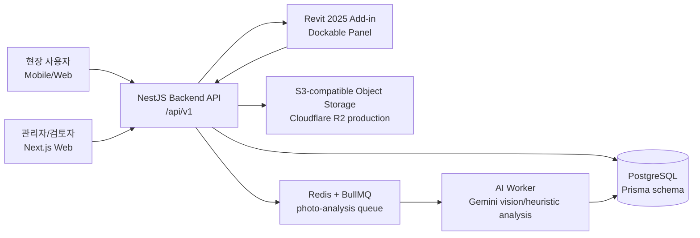
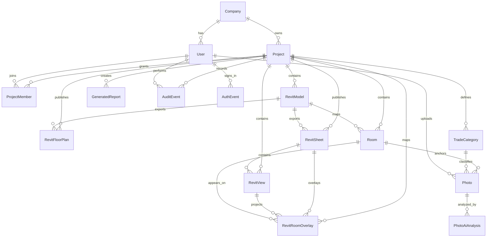
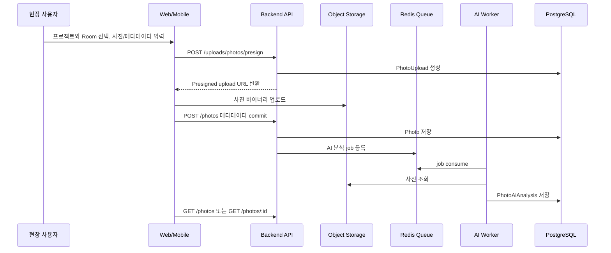
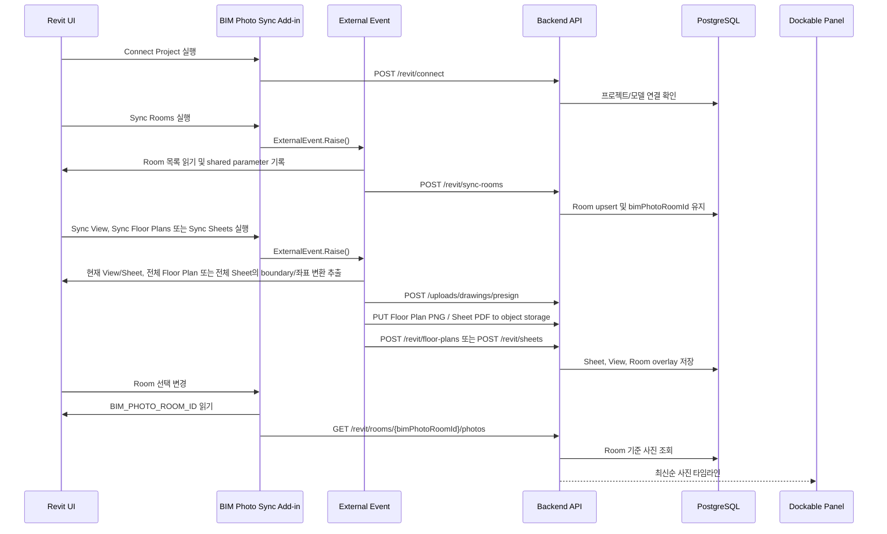
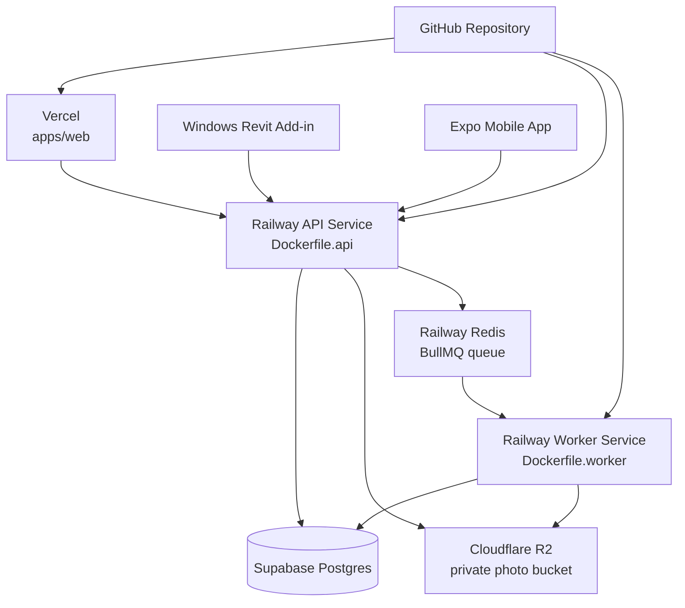

# BIM Photo Sync


BIM Photo Sync는 Revit Room을 기준 객체로 삼아 현장 사진, 작업 메모, AI 분석 결과를 프로젝트 단위로 연결하는 BIM 기반 현장 사진 관리 플랫폼입니다. 현장에 없던 사람도 웹, 모바일 앱, Revit Add-in에서 특정 방의 시공 상태를 시간순으로 확인할 수 있게 만드는 것이 핵심 목적입니다.

## 현재 MVP 범위

- 회사 단위 사용자 인증, 기존 회사 선택/신규 회사 등록, 프로젝트, 프로젝트 접근 권한 구조
- Revit Room과 플랫폼 Room의 안정적인 ID 기반 매핑
- 프로젝트, 방, 공사면, 공종, 작업일자, 작업자, 설명 기반 사진 업로드와 조회
- Presigned URL 기반 비공개 Object Storage 업로드
- Queue 기반 AI 분석 worker와 분석 결과 저장
- Revit 2025 Add-in에서 프로젝트 연결, Room Sync, 기본 Floor Plan view 동기화, Floor Plan PNG export, Sheet PDF export, 도면 위 Room polygon overlay 동기화, Room 선택 시 사진 타임라인 조회
- Next.js 웹 콘솔, Expo 모바일 앱, NestJS API, BullMQ worker, Prisma/PostgreSQL 데이터 모델

현재 범위에서 APS Viewer, Dynamo graph 실행, 고급 AI 진단 모델 재학습은 구현 대상이 아닙니다. 다만 Floor Plan/Sheet 구조는 정식 제품 단계에서 APS Viewer로 교체할 수 있도록 도면 표시 레이어와 Room/구역 선택 레이어를 분리합니다. 보고서는 현재 JSON, XLSX, DOCX, PDF, HWPX 다운로드를 제공합니다.

## 웹 콘솔 동작 범위

- 로그인 후 좌측 내비게이션으로 대시보드, 프로젝트, 방 목록, 사진, 평면도, 시트, 내 정보에 접근합니다. 보고서와 감사는 관리자 권한 계정에서만 표시됩니다.
- 대시보드는 전체 프로젝트 또는 선택한 프로젝트 기준으로 방, 사진, AI 분석, 보고서, Revit 모델 연결 현황을 API에서 집계해 표시합니다. 일반 작업자 계정에는 보고서 관련 카드가 표시되지 않습니다.
- 프로젝트 화면은 우리 회사 프로젝트 목록을 확인하고 작업 프로젝트를 설정하는 관리 화면입니다. 상위 관리자는 새 프로젝트 생성, Revit 연결 안내, 프로젝트 접근키 발급을 사용할 수 있고, 일반 사용자는 접근키 참여만 사용할 수 있습니다.
- 사진 화면은 사진 조회 탭과 사진 업로드 탭을 분리합니다. 조회 탭에는 조회 필터와 사진 상세만 표시하고, 업로드 탭에는 업로드 입력, 내용 입력, 공종 분류 관리, 업로드 상태 안내만 표시합니다.
- 사진 업로드 탭에서 프로젝트와 방을 선택하고 사진 파일, 공사면, 공종, 작업일자, 작업자, 내용을 입력해 업로드합니다. 작업자 기본값은 로그인 사용자 이름입니다. 업로드가 완료되면 성공 알림을 표시하고 사진 조회 탭으로 이동해 방 기준 목록에서 방금 업로드한 사진을 확인할 수 있습니다. 공사면은 바닥, 기준벽(출입문), 전면벽, 우측벽, 좌측벽, 벽(기타), 천장, 창호, 문, 배관, 전기, 기타로 구분합니다.
- 사진 조회 탭의 전체보기, 필터 적용, 방 선택 링크는 실제 API 조회를 수행합니다. 관리자 권한 계정은 사진 업로드 탭에서 현장 표시용 공종 분류를 추가/삭제할 수 있습니다. 공종 분류는 DB의 `TradeCategory`로 관리되며, 기본 공종은 프로젝트/회사 기준으로 자동 생성되고 사용자 지정 공종은 사진과 보고서 필터에 `trade_category_id`로 저장됩니다.
- 사진 조회 탭의 선택 사진 상세에는 관리자용 AI 분석 검토 패널이 있습니다. 관리자가 요약, 공종, 공사면, 공정 상태를 수정하면 `PhotoAiAnalysis`에 human review 값이 저장되고 `Photo`의 상태/분류에도 반영되어 이후 방 공정 색상과 보고서 근거가 개선됩니다. 이는 현재 구현의 반복 학습 루프이며, 모델 파라미터를 직접 재학습하는 기능은 아닙니다.
- 방 목록과 도면 overlay의 공정 색상은 Room의 공사면별 사진 상태를 기준으로 계산합니다. 사진이 없는 공사면은 0점(시작 전), 사진이 1장 이상 있으면 0.5점(진행 중), 사진 메모/AI 분석 또는 상태에 `완료`가 있으면 1점(완료)으로 계산합니다. 방 진행률은 `(공사면 점수 합계 / 공사면 수) x 100%`이며, 방 상태 뱃지는 모든 공사면이 완료일 때만 `완료`로 표시합니다.
- 방 목록 화면은 실제 API 방 목록을 검색, 새로고침, CSV 내보내기, 방 선택, 해당 방 사진 보기, 평면도 이동으로 연결합니다. 화면 상단에는 Revit Add-in 동기화 안내 배너와 우측 상세 패널을 표시하지 않아 테이블을 넓게 사용합니다.
- 평면도 탭은 Revit Add-in이 동기화한 기본 Floor Plan view 목록, Floor Plan PNG 배경, 방 polygon 구역을 표시합니다. 2D/3D 전환을 지원하며, 3D는 Add-in이 Floor Plan별 section box로 잘라 업로드한 OBJ 모델만 해당 평면도에 매칭해 표시합니다. 매칭되는 3D 모델이 아직 없으면 전체 `{3D}` 모델을 대신 보여주지 않고 방 polygon 기반 axonometric 도면 뷰와 재동기화 안내를 표시합니다. 2D 방 선택은 view projection polygon을 쓰고, OBJ 3D 방 선택은 Revit model coordinate `model_polygon`을 사용합니다. 사진 타임라인은 두 보기 모두 `BIM_PHOTO_ROOM_ID` 기준으로 유지합니다.
- 시트 탭은 Revit Add-in이 동기화한 Sheet PDF의 첫 페이지를 브라우저 canvas로 렌더링하고, 그 위에 별도 저장된 SVG 방 polygon overlay를 얹습니다. PDF embed/object toolbar에 의존하지 않으므로 방 클릭 영역이 도면 위에서 직접 동작합니다.
- 보고서는 관리자 권한 계정에서만 접근합니다. `POST /reports/generate`, `GET /reports`, `GET /reports/:reportId`, `GET /reports/:reportId/export?format=` 기반으로 초안 데이터를 생성/조회하고 JSON, `.xlsx`, `.docx`, `.pdf`, `.hwpx`로 다운로드할 수 있습니다. 생성 화면의 `AI 지시문` 입력값은 Gemini 보고서 프롬프트에 포함되며, 별도 채팅 UI는 두지 않습니다. 보고서 분류 순서는 프로젝트 -> 방(실) -> 공사면 -> 작업일자 -> 공종 -> 작성자(작업자)입니다. 날짜 끝 필터는 해당 날짜의 23:59:59까지 포함하고, `6월 작업보고서`처럼 월 단위 지시가 입력되면 명시 날짜가 없을 때 해당 월 범위를 자동 적용합니다. XLSX 내보내기는 제공된 보고서 양식의 시트 구조(표지, 주간공정보고, 사진대지, 전경사진)를 기준으로 생성합니다.
- 감사는 관리자 권한 계정에서만 접근합니다. 현재 프로젝트 참여자 목록을 실제 API로 조회하고 사용자를 선택하면 이름, 이메일, 회사, 전역 권한, 프로젝트 권한, 참여일을 확인할 수 있습니다. 사진 생성, 보고서 생성, 공종 관리 같은 활동 로그만 DB의 `AuditEvent`에서 조회하며 로그인 기록은 화면에 표시하지 않습니다. 활동 로그 상세 정보는 긴 문장도 여러 줄로 표시합니다.
- 내 정보는 로그인 사용자 이름, 역할, 회사명, Revit Add-in 사용 흐름, 계정 정보를 표시합니다. 프로필 사진은 presigned URL로 Object Storage에 업로드하고 `users.avatar_object_key`에 저장되어 좌측 내비게이션 사용자 원형 아바타에 지속 반영됩니다.
- 전체 관리는 `/admin` 경로의 `SUPER_ADMIN` 전용 화면입니다. 현재 운영 단계가 아니므로 별도 관리 도메인 대신 경로 기반으로 사용합니다. 전체 회사, 프로젝트, 사용자 수, 방 수, 사진 수, Revit 모델 연결 상태, 최근 업로드 사진을 회사 경계 없이 조회합니다.
- 웹 콘솔 레이아웃은 데스크톱, 태블릿, 모바일 폭에 맞춰 카드/필터/상세 패널을 자동 재배치합니다. 좁은 화면에서는 좌측 내비게이션이 아이콘 중심의 compact UI로 전환되고, 모바일 폭에서는 상단 가로 내비게이션으로 바뀝니다.

## 핵심 원칙

- Room이 시스템의 기준 객체입니다.
- PostgreSQL이 source of truth입니다.
- Revit은 BIM authoring tool이며 운영 데이터베이스가 아닙니다.
- Room 매핑은 이름이 아니라 `BIM_PHOTO_ROOM_ID`로 수행합니다.
- Revit 모델 수정은 External Event를 통해서만 수행합니다.
- Revit Add-in UI는 Dockable Panel을 사용합니다.
- 사진 원본은 비공개 Object Storage에 저장하고, DB에는 메타데이터와 object key를 저장합니다.
- Sheet와 Floor Plan은 시각적/공간 참조 데이터이고, 방 선택은 Revit Room/Area boundary에서 추출한 별도 polygon 데이터로 처리합니다.
- 사진, 이슈, 분석, 보고서는 canonical Room에 귀속하고, Floor Plan 또는 Sheet 위 클릭 영역은 Room Zone overlay로 관리합니다.

## 전체 시스템 그림



## 데이터 모델 요약



가장 중요한 연결은 `Project -> Room -> Photo -> PhotoAiAnalysis`입니다. Revit Room에는 공유 파라미터 `BIM_PHOTO_ROOM_ID`만 기록하고, 실제 사진/분석/검토 데이터는 백엔드 DB가 관리합니다. Revit Room의 `revit_unique_id`는 프로젝트 안에서만 고유하게 취급합니다. 같은 샘플 RVT를 다른 프로젝트에 다시 연결할 수 있으므로 Room upsert 기준은 `project_id + revit_unique_id`이며, 이미 다른 프로젝트가 사용하는 `BIM_PHOTO_ROOM_ID`가 모델에 남아 있으면 새 ID를 발급해 현재 프로젝트 Room으로 다시 기록합니다. 한 Room은 여러 Sheet나 확대 View에 반복 표시될 수 있으므로 화면 클릭 영역은 `RevitRoomOverlay`로 분리하고, 사진 데이터는 항상 Room에 연결합니다.

## 주요 데이터 흐름



## Revit Add-in 구현 흐름



Add-in은 `revit-addin/BimPhotoSyncAddin`에 있으며 .NET 8 WPF 기반입니다. `BimPhotoSyncApp`이 ribbon, Dockable Pane, External Event, selection changed handler를 등록합니다. `PhotoDockPane`은 Room 선택 결과를 받아 사진 타임라인과 AI 요약을 표시합니다.

`Sync Rooms`는 canonical Room ID 매핑과 `BIM_PHOTO_ROOM_ID` 기록을 담당합니다. 이후 `Sync Floor Plans`가 각 Floor Plan view 안에 실제로 보이는 Room만 다시 수집해 PNG 배경과 polygon zone을 Floor Plan 탭에 올립니다. 사용자는 Floor Plan 위 zone을 클릭해 사진을 올리지만, 사진 데이터는 항상 canonical Room에 저장됩니다. `Sync Floor Plans`는 Revit Project Browser의 기본 Floor Plan 그룹에 해당하는 1차 Level view만 대상으로 삼고, 확대도, life safety, working, wall base/top 같은 파생 view는 제외합니다. 실행 시 기존 Floor Plan 동기화 결과를 먼저 지워 오래된/과다 동기화 도면이 웹에 남지 않게 합니다. `Sync View`는 현재 열린 평면도 또는 현재 Sheet만 동기화하고, `Sync Sheets`는 전체 Sheet PDF와 Sheet overlay를 명시적으로 동기화합니다. Floor Plan PNG와 Sheet PDF는 화면 배경이고, Room 클릭은 도면 내부 텍스트/선분이 아니라 별도 overlay polygon으로 처리합니다. Room boundary는 Revit `SpatialElement.GetBoundarySegments` 기반이며, Floor Plan 좌표는 Revit 2025 API의 `View.GetModelToProjectionTransforms()`를 우선 사용하고, Sheet Viewport 좌표 변환은 `View.GetModelToProjectionTransforms()`와 `Viewport.GetProjectionToSheetTransform()` 조합을 사용합니다. Sheet sync payload는 대형 프로젝트에서도 API body limit에 덜 민감하도록 Add-in이 Sheet 단위로 나누어 업로드합니다. API는 Sheet 저장 transaction timeout을 120초로 설정하고 Room overlay를 batch insert해 Snowdon처럼 overlay가 많은 Sheet도 저장할 수 있게 합니다.

## Dynamo 사용 여부와 비교

현재 구현은 Dynamo를 사용하지 않습니다. Autodesk 공식 문서 기준으로 Dynamo는 Revit 안에서 graph를 만들어 반복 작업과 모델링/문서화 자동화를 줄이는 도구입니다. BIM Photo Sync는 지속 운영되는 웹/모바일/API/DB/스토리지/AI worker가 필요하므로 Add-in 중심 구조를 선택했습니다.

| 기준 | Revit Add-in 방식 | Dynamo 방식 |
| --- | --- | --- |
| 현재 채택 여부 | 채택 | 미채택 |
| 적합한 작업 | 상시 패널, 인증, API 통신, Room 선택 이벤트, 운영형 UI | 반복 모델링 자동화, 일회성 파라미터 정리, 사내 graph 배포 |
| 사용자 경험 | Revit ribbon과 Dockable Panel로 제품처럼 동작 | Dynamo 실행 환경과 graph 이해가 필요 |
| 백엔드 연동 | C# HttpClient와 설정 파일로 안정적 제어 | Python/노드 기반 HTTP 호출은 가능하지만 운영 UI에는 부적합 |
| 모델 쓰기 제어 | External Event와 Transaction으로 Revit API 규칙 준수 | graph 실행 시점 중심이라 상시 이벤트 처리에 약함 |
| 이 프로젝트에서의 역할 | Room sync와 사진 조회의 주 경로 | 후속 보조 도구 후보, 현재 README에는 구현으로 간주하지 않음 |

Dynamo를 후속 도구로 추가한다면 Room 파라미터 점검, 누락 Room 리포트, 모델 품질 검사처럼 Add-in의 운영 흐름을 보조하는 범위가 적절합니다.

## 서비스와 사용 사이트

| 사이트/서비스 | 현재 역할 | 동작 방식 |
| --- | --- | --- |
| GitHub | 소스 저장소, 브랜치/PR/이슈/코드리뷰 | 기능 브랜치에서 작업 후 PR로 main에 병합합니다. |
| Vercel | Next.js 웹 콘솔 배포 후보 | `apps/web`을 빌드하고 공개 웹 UI를 제공합니다. |
| Railway | NestJS API, AI worker, Redis 등 서버 배포 후보 | `railway.api.json`, `railway.worker.json`으로 API/worker 서비스를 분리 배포합니다. |
| Render | NestJS API와 Redis-compatible Key Value 배포 후보 | Railway를 쓰지 않을 때의 대체 배포 경로입니다. 무료 플랜에서는 API Web Service 안에서 `RUN_INLINE_AI_WORKER=true`로 AI 분석 worker를 함께 실행합니다. |
| Supabase | 운영 PostgreSQL 후보 | Prisma가 연결하는 canonical DB로 사용 가능합니다. Auth/Storage는 현재 자체 JWT/S3 흐름과 역할이 겹치므로 선택적으로만 사용합니다. |
| Cloudflare R2 | 운영 Object Storage 후보 | S3-compatible API로 presigned URL 업로드/다운로드를 처리합니다. |
| Google Gemini API | 사진 분석과 리포트 생성 AI | `GEMINI_API_KEY`가 설정되면 worker가 R2 원본 사진을 읽어 분석하고, reports service가 같은 키로 보고서를 생성합니다. 기본 모델은 `gemini-3.1-flash-lite`입니다. |
| Redis | 비동기 작업 큐 | BullMQ가 사진 AI 분석 job을 저장하고 worker가 처리합니다. |
| Autodesk Revit | BIM authoring 및 Room 기준 인터페이스 | Add-in이 Room ID를 쓰고 선택된 Room의 사진을 조회합니다. |
| Autodesk Dynamo | 자동화 보조 후보 | 현재 구현에는 포함되지 않습니다. |

## 배포/운영 구성 예시



운영에서는 PostgreSQL과 Object Storage를 관리형 서비스로 사용해도 API 계약은 유지됩니다. Railway API 컨테이너는 시작 시 `prisma migrate deploy`를 먼저 실행한 뒤 NestJS API를 시작하므로, `apps/api/prisma/migrations`에 추가된 DB 변경은 GitHub main 배포에 맞춰 적용됩니다.

## GitHub 연동 배포

운영 배포는 CLI 수동 배포보다 GitHub 연동 배포를 기본으로 합니다.

- Vercel: GitHub `main` branch push/merge 시 `apps/web` production deploy가 실행됩니다.
- Railway API service: GitHub repo `main` branch와 연결하고 config file path를 `railway.api.json`으로 지정합니다.
- Railway worker service: 같은 GitHub repo `main` branch와 연결하고 config file path를 `railway.worker.json`으로 지정합니다.
- API service는 `Dockerfile.api`, worker service는 `Dockerfile.worker`를 사용합니다.
- API healthcheck는 `/api/v1/health`입니다.
- CI는 `.github/workflows/ci.yml`에서 `npm ci`, `npm run typecheck`, `npm run build`를 실행합니다.

Railway 새 프로젝트 생성 후 `DATABASE_URL`, `DIRECT_URL`, `REDIS_URL`, `S3_ENDPOINT`, `S3_BUCKET`, `S3_ACCESS_KEY_ID`, `S3_SECRET_ACCESS_KEY`, `JWT_SECRET`를 Dashboard에서 입력합니다. 실제 사진 분석과 보고서 문장 생성을 Gemini로 돌리려면 API와 worker에 `GEMINI_API_KEY`를 추가하고, 필요 시 `GEMINI_VISION_MODEL`, `GEMINI_REPORT_MODEL`로 모델을 지정합니다. 현재 기본 모델은 `gemini-3.1-flash-lite`입니다. Render를 대체 배포로 쓸 경우에는 `render.yaml` Blueprint를 사용할 수 있으며, 무료 플랜에서는 별도 Background Worker가 없으므로 API 서비스 안에서 `RUN_INLINE_AI_WORKER=true`로 휴리스틱 분석만 함께 실행하는 구성이 현실적입니다.

## Repository Structure

```text
apps/api
  NestJS Backend API. 인증, 회사/프로젝트, Room, 업로드 presign, 사진 commit/조회,
  AI 분석 결과, Revit 연동 API를 담당합니다.

apps/ai-worker
  BullMQ worker. 업로드된 사진 분석 job을 처리하고 PhotoAiAnalysis를 저장합니다.

apps/web
  Next.js 웹 콘솔. 로그인, 대시보드, 프로젝트, 방 목록, 사진, 평면도, 시트, 감사, 보고서 화면을 제공합니다.

apps/mobile
  Expo React Native 현장 앱. 앱을 열면 빠른 촬영, 구역 선택, 선택 구역 업로드가 먼저 보이도록 작업자 중심 흐름을 제공합니다.

packages/shared
  앱, 웹, API, worker가 함께 사용할 수 있는 TypeScript 공통 정의 영역입니다.

revit-addin/BimPhotoSyncAddin
  Revit 2025용 C#/.NET 8 WPF Add-in 코드입니다.

revit-addin/BimPhotoSync.addin
  Revit Add-in manifest입니다.

revit-addin/package-addin.ps1
  Revit Add-in 산출물을 GitHub Release용 설치 ZIP 패키지로 묶습니다.

revit-addin/install.ps1
  Release 패키지를 현재 Windows 사용자의 Revit Addins 폴더에 설치합니다.

revit-addin/uninstall.ps1
  설치된 BIM Photo Sync manifest와 Add-in 파일을 제거합니다.
```

## API 구조

모든 API는 `/api/v1` prefix를 사용합니다.

| Domain | Routes |
| --- | --- |
| Auth | `GET /auth/companies`, `POST /auth/register`, `POST /auth/login`, `GET /auth/me`, `PATCH /auth/me/avatar`, `GET /auth/users/:userId/avatar` |
| Projects | `GET /projects`, `POST /projects`, `POST /projects/access-key/preview`, `POST /projects/join`, `POST /projects/:projectId/access-key` |
| Project Members | `GET /projects/:projectId/members` |
| Dashboard | `GET /dashboard/summary?project_id=` |
| Rooms | `GET /projects/:projectId/rooms`, `POST /projects/:projectId/rooms`, `PATCH /rooms/:roomId` |
| Uploads | `POST /uploads/photos/presign`, `POST /uploads/drawings/presign`, `POST /uploads/avatars/presign` |
| Photos | `POST /photos`, `GET /photos`, `GET /photos/:photoId`, `GET /photos/:photoId/object` |
| AI | `GET /photos/:photoId/analysis`, `PATCH /photos/:photoId/analysis/review` |
| Revit | `POST /revit/connect`, `POST /revit/sync-rooms`, `POST /revit/floor-plans`, `GET /revit/projects/:projectId/floor-plans`, `POST /revit/sheets`, `GET /revit/projects/:projectId/sheets`, `GET /revit/sheets/:sheetId/asset`, `GET /revit/rooms/:bimPhotoRoomId/photos` |
| Trade Categories | `GET /projects/:projectId/trade-categories`, `POST /projects/:projectId/trade-categories`, `DELETE /projects/:projectId/trade-categories/:categoryId` |
| Audit | `GET /projects/:projectId/audit-events` |
| Reports | `POST /reports/generate`, `POST /reports/chat`, `GET /reports`, `GET /reports/:reportId`, `GET /reports/:reportId/export?format=JSON\|XLSX\|DOCX\|PDF\|HWP` |
| Admin | `GET /admin/overview` |

## 계정과 역할

일반 회원가입으로 만들 수 있는 역할은 `WORKER`, `COMPANY_ADMIN`입니다. 가입 화면에서는 이미 등록된 회사를 선택하거나 신규 회사를 등록할 수 있습니다. 기존 회사에 가입하는 사용자는 항상 `WORKER`로 생성되어, 임의로 기존 회사의 상위 관리자 권한을 획득할 수 없습니다. 신규 회사를 등록하는 경우에만 가입 유형에서 `WORKER` 또는 `COMPANY_ADMIN`을 선택합니다.

`SUPER_ADMIN`은 운영자가 DB 작업으로만 생성합니다.

```powershell
$env:DATABASE_URL = "postgresql://..."
$env:DIRECT_URL = "postgresql://..."
$env:SUPER_ADMIN_EMAIL = "admin@example.com"
$env:SUPER_ADMIN_PASSWORD = "change-me-strong"
$env:SUPER_ADMIN_NAME = "최반장"
npm run create:super-admin
```

| 역할 | 범위 |
| --- | --- |
| `WORKER` | 접근키로 참여한 프로젝트의 사진 업로드/조회 |
| `COMPANY_ADMIN` | 본인 회사 프로젝트 생성, 접근키 생성, Revit 연결/동기화, 보고서 초안 생성 |
| `SUPER_ADMIN` | 전체 회사/프로젝트/사진/Revit 연결 상태 조회 |

## TypeScript 빌드 기준

- 새 코드에 `any`를 도입하지 않습니다.
- API 응답, DB 결과, 사용자 입력처럼 외부에서 들어오는 값은 `unknown` 또는 명확한 DTO/응답 타입으로 받고, 내부에서 타입을 좁혀 사용합니다.
- `filter(Boolean)` 대신 `filter((value): value is string => typeof value === "string" && value.length > 0)`처럼 명시적 타입 가드를 사용합니다.
- `null`/`undefined`는 함수 진입부에서 처리하고, 이후 주요 로직은 non-null 값을 전제로 작성합니다.
- 커밋 전 `npm run typecheck`와 관련 build를 실행해 CI 기준을 맞춥니다.

## 보안과 RLS 정책

현재 인증은 Supabase Auth가 아니라 NestJS 자체 JWT입니다. 회사/프로젝트/Room/사진 권한은 API 서비스 계층에서 `company_id`, project membership, role을 기준으로 검사합니다.

Supabase PostgreSQL은 직접 클라이언트 접근용이 아니라 서버 DB로 사용합니다. 따라서 RLS는 end-user policy가 아니라 안전장치로 적용합니다.

- `anon`, `authenticated` role은 앱 테이블 권한을 제거합니다.
- 앱 테이블에는 RLS를 활성화해 Supabase 클라이언트 키가 실수로 노출되어도 직접 조회/수정하지 못하게 합니다.
- Prisma/NestJS 서버 연결은 DB owner/server connection으로 유지합니다.

## Product Notes

- 방 목록의 공정 진행률은 방 자체 입력값이 아니라 해당 방에 연결된 공사면별 사진과 AI 분석 결과의 `progress_status` 집계에 기반합니다. 사진이 없는 공사면은 0점, 사진이 1장 이상 있으면 0.5점, 사진 메모/AI 검토에 완료가 있으면 1점으로 환산해 퍼센트를 계산합니다. 사진 설명에 완료/이슈 키워드가 있으면 worker가 `COMPLETED` 또는 `BLOCKED`로 분류하고, 그 외에는 기본적으로 `IN_PROGRESS` 또는 `PENDING_REVIEW` 흐름을 탑니다. 방 상태 뱃지는 전체 공사면이 완료일 때만 `완료`, 일부 공사면에 진행/완료 흔적이 있으면 `진행중`, 모든 공사면이 비어 있으면 `시작 전`입니다.
- 보고서는 DB에 JSON 구조로 저장되며 다운로드 시 JSON, `.xlsx`, `.docx`, `.pdf`, `.hwpx`로 내보낼 수 있습니다. 내보내기 문서는 제목, 생성일, 작성자, 상황분석, 변화 과정, 비교 사진 근거, 메모를 채우며, 생성 화면의 `AI 지시문` 입력값은 보고서 생성 프롬프트에 반영됩니다. XLSX는 `보고서 형식.xlsx`의 주요 시트명과 병합 레이아웃을 따라 표지/주간공정보고/사진대지/전경사진 형태로 구성합니다.
- Supabase Auth 기반 직접 테이블 접근으로 전환할 경우에는 `auth.uid()` 기반 회사/프로젝트 정책을 별도 migration으로 추가해야 합니다.

## 기술 스택과 선택 이유

| 영역 | 기술 | 선택 이유 |
| --- | --- | --- |
| Web | Next.js 15, React 18, TypeScript | Vercel 배포와 App Router metadata/OG 설정에 적합하고 운영 콘솔 개발 속도가 빠릅니다. |
| Mobile | Expo React Native | 현장 사진 촬영/선택 앱을 iOS/Android 공통 코드로 빠르게 구성할 수 있습니다. |
| API | NestJS, TypeScript | 모듈 경계가 명확하고 인증, DTO validation, 서비스 계층 분리에 적합합니다. |
| DB ORM | Prisma | PostgreSQL schema와 migration을 코드로 추적하기 쉽습니다. |
| DB | PostgreSQL | Room 중심 관계형 데이터, 권한, 조회 필터, 리포트 집계에 적합합니다. |
| Queue | Redis, BullMQ | 업로드 요청과 AI 분석을 분리해 API 응답성과 재시도 가능성을 확보합니다. |
| Storage | S3-compatible API, Cloudflare R2 | 대용량 사진과 도면 export asset을 DB 밖의 비공개 Object Storage에 저장합니다. |
| Revit Add-in | C# .NET 8, WPF, Revit API | Revit API와 UI 통합의 표준 경로이며 Dockable Panel과 External Event를 직접 사용할 수 있습니다. |
| AI Worker | Node.js worker | Gemini 비전 분석과 휴리스틱 fallback을 API와 분리해 처리합니다. |
| Reports AI | Google Gemini API optional | 보고서 초안 생성을 외부 LLM으로 확장할 수 있고, 미설정 시에도 구조화된 리포트 데이터를 유지합니다. |
| DevOps | Dockerfile.api, Dockerfile.worker, GitHub 연동 배포 | API와 worker 실행 단위를 분리하고 main merge 기준으로 배포합니다. |

## 잠재 수요층

- 건설사 현장 관리자: 방별 시공 상태와 하자 근거 사진을 빠르게 추적해야 하는 팀
- CM/감리 조직: 특정 Room, 공종, 작업일자의 증빙 자료를 검토해야 하는 조직
- 설계/BIM 팀: Revit 모델과 현장 사진을 Room 기준으로 연결해 의사소통 비용을 줄이고 싶은 팀
- 협력업체 관리자: 공종별 작업 완료/보류 상태를 사진과 메모로 남겨야 하는 팀
- 발주처/운영사: 준공 전후 공간별 이력과 유지관리 근거 자료를 확보해야 하는 조직

## 활용 시나리오

| 시나리오 | 흐름 | 효과 |
| --- | --- | --- |
| 방별 공정 사진 관리 | 현장 작업자가 Room을 선택하고 사진/공종/공사면/메모를 업로드 | 사진 폴더명이나 메신저 검색 없이 Room 기준으로 추적합니다. |
| Revit 기반 검토 회의 | BIM 담당자가 Revit에서 Room을 클릭하고 Dockable Panel에서 최신 사진 확인 | 모델과 현장 사진 사이의 컨텍스트 전환을 줄입니다. |
| 하자/이슈 근거 확보 | 특정 Room의 작업일자별 사진과 AI 요약을 조회 | 원인 추적과 책임 구분을 위한 증빙을 빠르게 찾습니다. |
| 월간/주간 보고 준비 | 프로젝트, 공종, 기간 필터로 사진과 분석 내용을 모음 | 보고서 자동화의 입력 데이터를 구조화합니다. |
| 원격 현장 확인 | 본사/발주처가 웹 콘솔에서 Room별 최신 상태 확인 | 현장 방문 빈도와 커뮤니케이션 비용을 줄입니다. |

## Revit Add-in 배포와 설치

Revit Add-in은 GitHub Releases의 설치 ZIP으로 배포합니다. 최신 설치 파일은 [BIM Photo Sync Releases](https://github.com/KHSOL/BIMPhotoSync/releases/latest)에서 받을 수 있습니다.

설치 대상은 Revit 연동 권한이 있는 상위 관리자 또는 BIM 담당자입니다. 일반 현장 작업자는 Add-in을 설치하지 않고 웹/모바일에서 프로젝트 참여, 사진 업로드, Room별 조회를 사용합니다.

필수 환경:

- Windows PC
- Autodesk Revit 2025
- BIM Photo Sync 계정과 프로젝트 권한
- Backend API URL: `https://api-production-1d018.up.railway.app/api/v1`

설치 흐름:

1. GitHub Releases에서 `BimPhotoSyncAddin-Revit2025-Release.zip`을 다운로드합니다.
2. ZIP 압축을 풉니다.
3. 압축 해제 폴더의 `설치하기.cmd`를 더블클릭합니다.
4. Revit 2025를 다시 시작합니다.
5. Revit 상단의 `BIM Photo Sync` 탭이 보이면 설치가 완료된 상태입니다.

삭제는 같은 패키지의 `삭제하기.cmd`를 더블클릭합니다.

`install.ps1`은 내부 실행 스크립트입니다. 더블클릭하면 메모장으로 열릴 수 있으므로 설치 파일로 사용하지 않습니다.

Add-in 사용 흐름:

1. 웹에서 상위 관리자 계정으로 프로젝트를 생성하거나 기존 프로젝트를 선택합니다.
2. Revit에서 연결할 모델을 엽니다.
3. `BIM Photo Sync` 탭의 `Connect`를 클릭합니다.
4. Backend API URL, 이메일, 비밀번호를 입력하고 `Login / Refresh Projects`를 누릅니다.
5. 웹에서 만든 프로젝트를 선택하고 `Save + Connect`를 누릅니다.
6. `Sync Rooms`로 Revit Room과 `BIM_PHOTO_ROOM_ID`를 동기화합니다.
7. `Sync Floor Plans`로 기본 Floor Plan PNG와 Room polygon 구역을 웹 Floor Plan 탭에 동기화합니다.
8. 전체 Sheet PDF와 Sheet별 Room overlay가 필요한 경우에만 `Sync Sheets`를 실행합니다.

브라우저는 사용자 PC의 Revit 파일 목록을 직접 읽을 수 없습니다. Revit 모델 감지, 프로젝트 연결, Room/Floor Plan/Sheet 동기화는 Revit Add-in이 담당합니다.

기존 Add-in을 이미 실행해 저장된 설정이 있다면 `%APPDATA%\BimPhotoSync\config.json`의 `ApiBaseUrl`이 기본값보다 우선합니다. Railway 프로젝트를 새로 연결한 뒤에는 Connect 창에서 Backend API URL을 위 Railway 주소로 다시 입력해 저장하거나, 해당 config 파일의 `ApiBaseUrl`을 직접 수정합니다.

현재 웹 Floor Plan/Sheets는 export asset + Room overlay 방식입니다. Floor Plan은 Revit PDF page 여백과 view projection 좌표가 어긋나는 문제를 줄이기 위해 View PDF가 아니라 PNG view image를 업로드하고, Sheets는 PDF를 유지합니다. 3D 전환은 Revit Add-in의 `3D Model` 동기화가 각 Floor Plan의 crop/Room 경계를 기준으로 만든 임시 sectioned 3D view를 OBJ로 업로드하면 Three.js `OBJLoader`로 렌더링합니다. OBJ export는 벽, 바닥, 천장, 지붕, 계단, 난간, 기둥, 구조 프레임 카테고리를 대상으로 하며 가구, 문, 창, 커튼월, 일반 모델은 제외합니다. Add-in은 section box와 교차하는 요소만 OBJ로 내보내고, API는 같은 Floor Plan `source_view_id`의 3D 자산을 누적하지 않고 최신 자산으로 교체합니다. Floor Plan sync payload는 2D PNG overlay용 view projection `polygon`과 OBJ 3D 선택용 Revit model coordinate `model_polygon`을 함께 저장합니다. 웹 3D 뷰어는 Revit OBJ에 같이 포함될 수 있는 작은 부유 부품과 얇은 상세 객체를 숨기고, 보이는 큰 mesh 기준으로 모델을 바닥 그리드에 맞춰 정렬합니다. 3D 선택 overlay는 `model_polygon`을 OBJ와 같은 좌표계인 Revit `(X, Z, -Y)` 기준으로 배치해 Room polygon 클릭이 모델 위에서 동작하도록 유지합니다. 3D 모델 자산은 `RevitModelAsset`으로 관리되고 R2/S3 object key, MIME type, file size, checksum, source view id를 저장합니다. 웹과 API는 현재 선택된 Floor Plan과 `source_view_id`가 정확히 일치하는 3D 자산만 사용하며, 전체 `{3D}` 모델은 Floor Plan 3D 후보에서 제외합니다. 매칭되는 OBJ가 없으면 기존 Room polygon 기반 axonometric fallback과 최신 Add-in에서 `3D Model`을 다시 실행하라는 안내를 표시합니다. 새 Add-in 설치 후 기존 프로젝트를 갱신할 때는 Revit에서 `Sync Floor Plans`를 먼저 실행해 `model_polygon`을 저장하고, 이어서 `3D Model`을 실행해 Floor Plan별 3D 자산을 교체 업로드합니다. 정상 동기화 후 Revit 알림은 `Synced N Floor Plan section 3D models.` 형식이어야 하며, 웹 3D 모델 선택에는 `{3D}`가 아니라 `L2`, `L3`처럼 Floor Plan 이름이 표시되어야 합니다.

모바일 앱은 `apps/mobile`의 Expo React Native 앱입니다. monorepo에서 Expo entry가 루트 `App`을 찾지 않도록 `apps/mobile/index.js`를 진입점으로 사용합니다. 현장 개발 테스트는 같은 Wi-Fi에서 `npm --workspace apps/mobile run start:lan`을 실행한 뒤 iPhone/Galaxy의 Expo Go로 QR을 스캔하는 방식이 가장 안정적입니다. 외부망 테스트가 필요하면 `npm --workspace apps/mobile run start:tunnel`을 사용할 수 있지만, ngrok 터널은 네트워크/방화벽 상태에 따라 시간 초과될 수 있습니다. 흰 화면이나 오래된 번들 오류가 보이면 `cd apps/mobile && npx expo start --tunnel --clear`로 Metro 캐시를 비워 재시작합니다. 모바일 Metro 설정은 monorepo 루트의 React 18과 모바일 앱의 React 19가 섞이지 않도록 모바일 앱의 React 해석 경로를 고정합니다. 터널 실행에 필요한 `@expo/ngrok`은 mobile workspace dev dependency에 고정되어 있으므로 `npm install` 후 별도 전역 설치 질문 없이 실행할 수 있습니다.

다른 사람이 설치할 수 있는 Android 테스트 APK는 Expo 계정 로그인 후 `apps/mobile` 기준으로 `npm run build:android:preview`를 실행해 EAS internal distribution build로 생성합니다. EAS 프로젝트는 `@khsol/bim-photo-sync` / `c67aaba8-2622-4ea4-b17d-bb34a380d088`로 연결되어 있습니다. 최신 Android preview APK는 EAS build `d5c641db-dcf5-4256-8f41-fadabd129832`에서 생성된 `https://expo.dev/artifacts/eas/sp58ymdU2KExqqYvwuwWtd.apk`입니다. iOS는 Apple 정책상 TestFlight 또는 Ad Hoc/Enterprise 배포가 필요하므로 Apple Developer 계정과 기기 등록 또는 App Store Connect 설정이 필요합니다. `apps/mobile/app.json`에는 `ITSAppUsesNonExemptEncryption: false`가 설정되어 있으며, iOS preview build는 `npm run build:ios:preview`, Android+iOS 동시 preview build는 `npm run build:preview`, 스토어 제출용 Android AAB는 `npm run build:android:production`, iOS 스토어 빌드는 `npm run build:ios:production`을 사용합니다.

## 운영 검증 기준

- Revit 시작 시 BIM Photo Sync ribbon과 Dockable Panel이 로드됩니다.
- Connect Project가 API 연결과 인증을 통과합니다.
- Sync Rooms가 Revit Room에 `BIM_PHOTO_ROOM_ID`를 기록합니다.
- Sync Floor Plans가 Floor Plan PNG와 Room polygon을 백엔드에 업로드합니다.
- 3D Model이 Floor Plan별 sectioned OBJ를 업로드하고 `%APPDATA%\BimPhotoSync\validation.log`에 `Synced N Floor Plan section 3D models.`를 남깁니다.
- Floor Plan 3D 모델 선택에 전체 `{3D}` 모델이 보이지 않고 현재 평면도와 같은 이름의 3D 자산만 표시됩니다.
- Sync Sheets가 Sheet PDF와 Room overlay polygon을 백엔드에 업로드합니다.
- Floor Plan 탭에서 Room polygon을 클릭할 수 있습니다.
- Sheets 탭에서 Sheet PDF 위 Room polygon을 클릭할 수 있습니다.
- Room 선택 시 `GET /api/v1/revit/rooms/{bimPhotoRoomId}/photos`가 호출됩니다.
- 사진은 `workDate`, `takenAt`, `uploadedAt` 기준의 최신순 타임라인으로 표시됩니다.
- 사진이 없는 Room은 오류가 아니라 명확한 empty state를 표시합니다.
- Revit 모델 쓰기는 External Event 밖에서 발생하지 않습니다.

## 디자인 시스템

UI는 `designsystem.png`의 운영형 대시보드 방향을 따릅니다.

| Token | Value |
| --- | --- |
| Primary Blue | `#2563EB` |
| Blue Scale | `#EFF6FF`, `#CFE2FF`, `#99C2FF`, `#2563EB`, `#1D4ED8`, `#1E40AF`, `#0F172A` |
| Semantic | success `#22C55E`, warning `#F59E0B`, error `#EF4444`, info `#0EA5E9`, neutral `#6B7280` |
| Font | Pretendard fallback stack |
| Layout | 8px spacing grid, compact operational density |
| Components | 카드 radius 8px 이하, 마케팅 페이지보다 업무 도구 밀도 우선 |

반응형 레이아웃은 모든 운영 페이지에서 viewport 기준 가로 스크롤이 생기지 않도록 관리합니다. 페이지/패널/grid/table 컨테이너는 `min-width: 0`과 `max-width: 100%`를 기본으로 두고, 화면이 좁아질 때는 고정 최소폭 대신 auto-fit grid, 말줄임, compact table cell padding을 사용합니다. 모바일 폭에서는 사이드바 내비게이션도 가로 스크롤 대신 줄바꿈 가능한 아이콘 행으로 전환합니다. 카드 선택 상태와 진행률 배지는 외부 box-shadow나 고정폭으로 카드 밖에 튀어나오지 않게 내부 inset 표시와 축소 가능한 grid track을 사용합니다.

## OG 이미지

웹 OG 이미지는 `apps/web/public/OGimg.png`를 사용합니다. Next.js metadata는 `/OGimg.png`를 `1200x630` PNG로 선언하고, `NEXT_PUBLIC_SITE_URL`, `VERCEL_PROJECT_PRODUCTION_URL`, `VERCEL_URL` 순서로 `metadataBase`를 계산합니다. 파일은 링크 미리보기 표준 비율인 `1200x630`으로 맞추고, 원본 그래픽을 contain 방식으로 배치해 카카오톡, Slack, GitHub, X/Twitter 등에서 중앙 크롭되어도 핵심 텍스트와 제품 화면이 잘리지 않도록 관리합니다. 루트의 `OGimg.png`는 README 미리보기와 원본 관리용 동일 이미지입니다.

## 참고 자료

- [Autodesk Revit API External Events](https://help.autodesk.com/cloudhelp/2018/ENU/Revit-API/Revit_API_Developers_Guide/Advanced_Topics/External_Events.html)
- [Autodesk Revit API Parameters](https://help.autodesk.com/cloudhelp/2024/ENU/Revit-API/files/Revit_API_Developers_Guide/Basic_Interaction_with_Revit_Elements/Revit_API_Revit_API_Developers_Guide_Basic_Interaction_with_Revit_Elements_Parameters_html.html)
- [Autodesk SharedParameterElement](https://help.autodesk.com/view/RVT/2026/ENU/?guid=d8a0f2ae-7e10-39bd-e362-3756cbae661b)
- [Revit API Viewport.GetProjectionToSheetTransform](https://www.revitapidocs.com/2026/5991dc40-234a-4835-cc06-07524d2e61a4.htm)
- [Revit API View.GetModelToProjectionTransforms](https://www.revitapidocs.com/2024/593acdf3-9c82-d12a-4fc3-f15a636fd3d9.htm)
- [Revit API SpatialElement.GetBoundarySegments](https://www.revitapidocs.com/2019/8e0919af-6172-9d16-26d2-268e42f7e936.htm)
- [Revit API PDFExportOptions](https://www.revitapidocs.com/2023/6d7d9fad-82a3-e5f6-7d26-4e42b6579a35.htm)
- [Autodesk Dynamo Graphs for Revit](https://help.autodesk.com/view/RVT/2025/ENU/?guid=RevitDynamo_About_Creating_Dynamo_Graphs_for_Revit_html)
- [Next.js Metadata and OG Images](https://nextjs.org/docs/app/getting-started/metadata-and-og-images)
- [Supabase Documentation](https://supabase.com/docs/)
- [Cloudflare R2 S3 API Compatibility](https://developers.cloudflare.com/r2/api/s3/api/)
- [Railway Services Documentation](https://docs.railway.com/services)
- [Render Blueprint YAML Reference](https://render.com/docs/blueprint-spec)
- [Render Free Instances](https://render.com/free)
- [BIM and AR/VR Systematic Literature Review](https://arxiv.org/abs/2306.12274)
- [BIM Hyperreality for Deep Learning](https://arxiv.org/abs/2105.04103)
