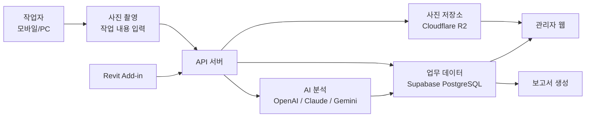
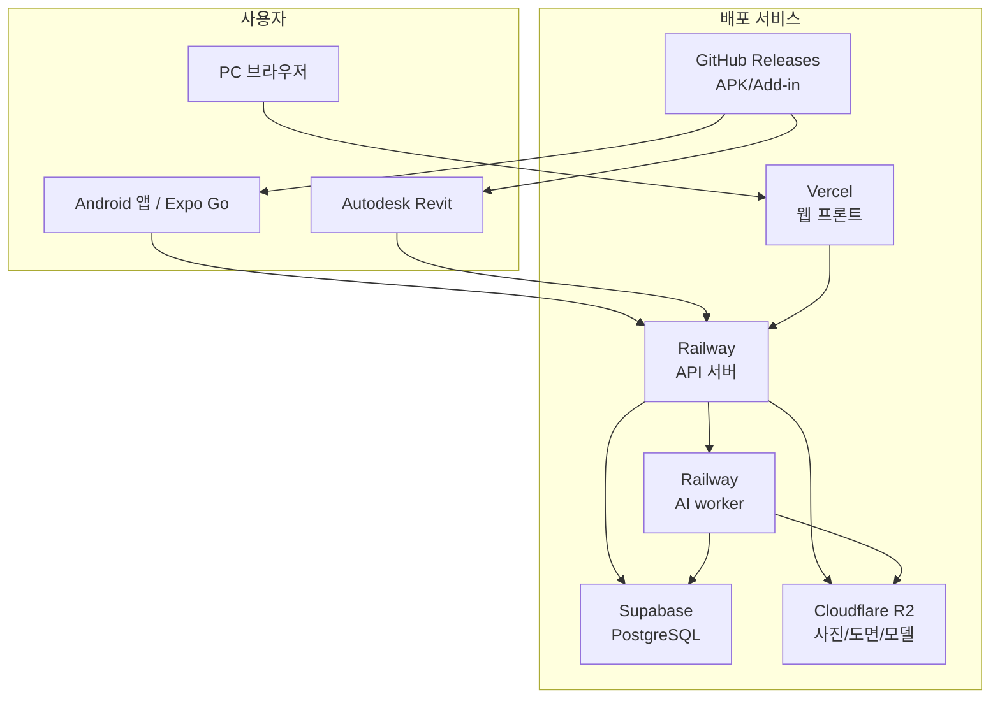
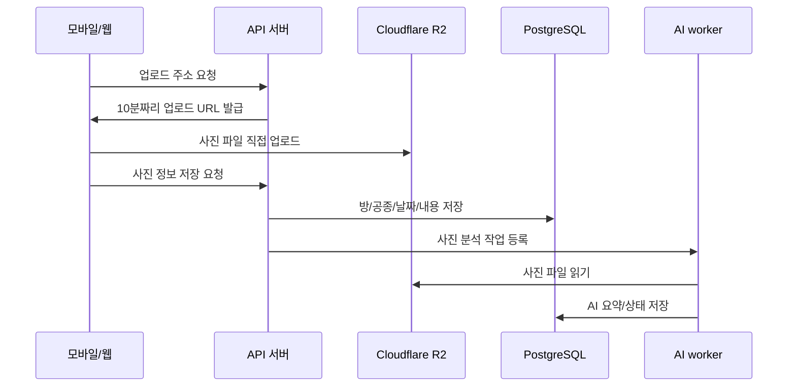
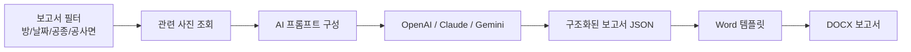
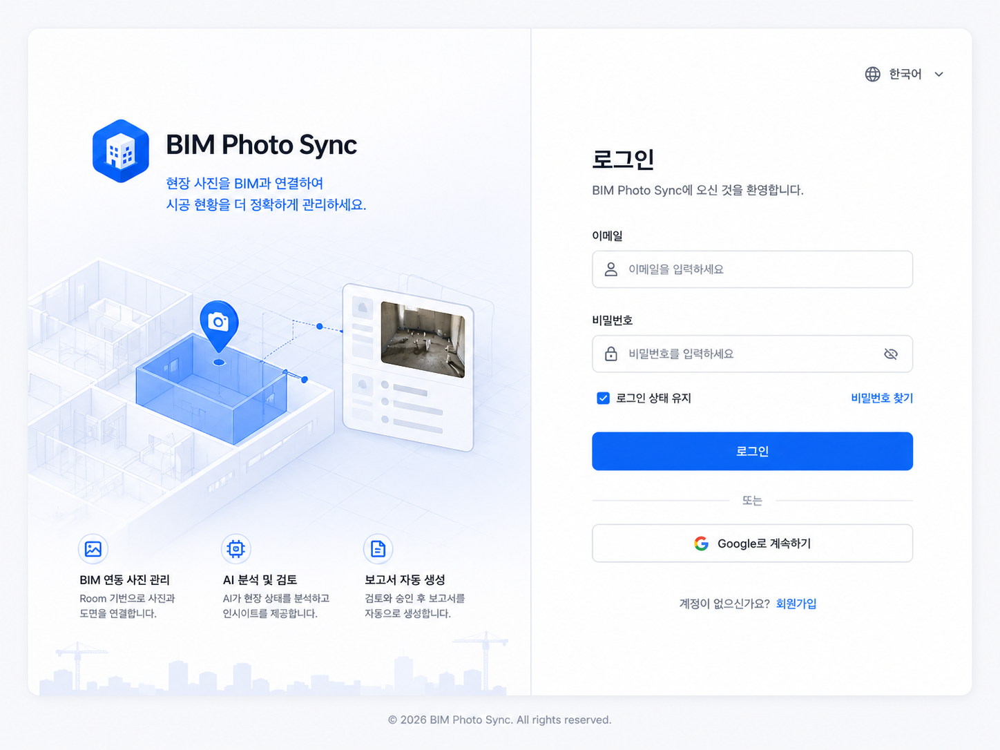
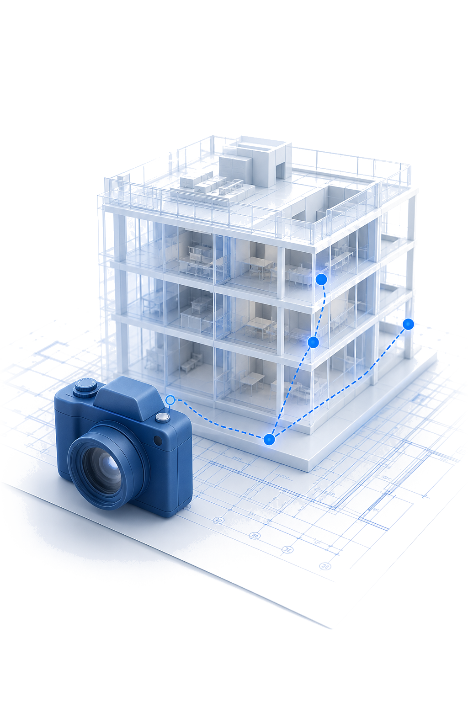

# BIM Photo Sync - 비전공자용 쉬운 설명서


> BIM Photo Sync는 Revit 도면의 "방"과 현장 사진을 연결해서, 현장에 가지 않은 사람도 공정 상황을 사진, AI 요약, 보고서로 확인할 수 있게 만든 서비스입니다.

## 한 줄 요약

현장 작업자는 모바일에서 바로 사진을 찍어 올리고, 관리자는 PC에서 도면 위 방별 진행 상태와 AI 보고서를 확인합니다.



## 누가 쓰나요?

| 사용자 | 주 사용 화면 | 하는 일 |
|---|---|---|
| 관리자 | PC 웹 + Revit | 프로젝트 생성, 접근키 발급, 도면 동기화, 사진 검토, 보고서 생성 |
| 작업자 | 모바일 앱 | 사진 촬영, 방 선택, 공종/공사면/작업일자/내용 입력 |
| 작업자 | PC 웹 | 사진 업로드와 조회, 평면도 확인 |
| BIM 담당자 | Revit Add-in | Revit 방, 평면도, 시트, 3D 모델을 웹 서비스에 동기화 |

## 사용한 기술 스택

### 화면


- **Next.js / React**: 관리자와 작업자가 PC 브라우저에서 쓰는 웹 화면입니다.
- **Expo / React Native**: 작업자가 휴대폰에서 사진을 찍고 업로드하는 모바일 앱입니다.

### 서버와 데이터


- **NestJS**: 웹, 모바일, Revit Add-in이 모두 호출하는 API 서버입니다.
- **PostgreSQL**: 프로젝트, 방, 사진, 보고서, 권한 정보를 저장하는 주 데이터베이스입니다.
- **Prisma**: 서버 코드에서 DB를 안정적으로 읽고 쓰기 위한 도구입니다.
- **Redis / BullMQ**: 사진 업로드 후 AI 분석을 백그라운드 작업으로 처리하는 큐입니다.

### 파일 저장, 배포, AI


- **Cloudflare R2**: 사진, 도면 이미지, 3D 모델 파일을 저장합니다.
- **Vercel**: PC 웹 화면을 배포합니다.
- **Railway**: API 서버와 AI worker를 실행합니다.
- **Supabase**: PostgreSQL 데이터베이스를 제공합니다.
- **GitHub Releases**: Android APK와 Revit Add-in 설치 파일을 배포합니다.
- **EAS Build**: Android 앱 APK를 빌드합니다.
- **OpenAI**: 사진을 직접 보고 현장 상태를 분석합니다.
- **OpenAI / Claude / Gemini**: 보고서 문장을 생성할 때 선택 가능한 AI 모델입니다.
- **Autodesk Revit Add-in**: Revit 안에서 방, 평면도, 시트, 3D 모델을 서버로 보냅니다.

## 배포 구조



## 주요 기능

| 기능 | 쉽게 말하면 | 구현 위치 |
|---|---|---|
| 로그인/가입 | 회사별로 데이터를 분리해서 로그인 | `apps/api/src/auth`, `apps/web`, `apps/mobile` |
| 프로젝트 접근키 | 내부자만 프로젝트에 참여하게 하는 초대키 | `apps/api/src/projects` |
| Revit 방 동기화 | Revit Room을 웹의 방 목록으로 가져오기 | `revit-addin/BimPhotoSyncAddin` |
| 평면도 동기화 | Revit Floor Plan을 이미지와 방 좌표로 저장 | `revit-addin/BimPhotoSyncAddin/Commands` |
| 3D 모델 동기화 | Revit 3D View/층별 모델을 웹에서 볼 수 있게 업로드 | `revit-addin/BimPhotoSyncAddin/Commands` |
| 사진 업로드 | 방, 공사면, 공종, 날짜, 작업 내용을 사진과 저장 | `apps/api/src/uploads`, `apps/api/src/photos` |
| AI 사진 분석 | 사진을 보고 공정 상태와 요약을 생성 | `apps/ai-worker/src/main.ts` |
| 보고서 생성 | 필터 조건에 맞는 사진으로 Word 보고서 생성 | `apps/api/src/reports` |
| 감사 로그 | 누가 무엇을 했는지 기록 | `apps/api/src/projects`, `apps/web` |
| 모바일 앱 | 현장에서 빠르게 사진 촬영 및 업로드 | `apps/mobile/App.tsx` |

## 실제 사용 흐름

### 1. 관리자가 프로젝트를 만든다

1. 관리자 계정으로 로그인합니다.
2. 새 프로젝트를 만듭니다.
3. 접근키를 생성해 작업자에게 전달합니다.

### 2. Revit에서 도면을 연결한다

1. Revit에서 BIM Photo Sync Add-in을 엽니다.
2. 프로젝트를 연결합니다.
3. `Rooms`, `Floor Plans`, `Sheets`, `3D Model`을 동기화합니다.
4. 웹에서 방 목록, 평면도, 시트, 3D 모델을 확인합니다.

### 3. 작업자가 사진을 올린다

1. 모바일 앱 또는 PC 웹에서 로그인합니다.
2. 프로젝트와 방을 선택합니다.
3. 사진, 공사면, 공종, 작업일자, 작업 내용을 입력합니다.
4. 업로드하면 사진은 Cloudflare R2에 저장되고, 정보는 DB에 저장됩니다.
5. AI worker가 사진을 분석해 요약과 상태를 저장합니다.

### 4. 관리자가 검토하고 보고서를 만든다

1. 사진 메뉴에서 사진과 AI 요약을 검토합니다.
2. 필요하면 공사면/공종/상태를 수정합니다.
3. 보고서 메뉴에서 방, 날짜, 공종 등 필터를 선택합니다.
4. OpenAI 또는 Claude 같은 AI 모델을 선택해 Word 보고서를 생성합니다.

## 사진 업로드는 어떻게 동작하나요?

사진은 서버를 한 번 거쳐서 저장하는 방식이 아니라, 더 빠르고 안정적인 방식으로 저장합니다.



핵심 코드:

```ts
// apps/api/src/uploads/uploads.service.ts
const objectKey = `photos/${dto.project_id}/${new Date().toISOString().slice(0, 10)}/${uploadId}.${ext}`;
const command = new PutObjectCommand({
  Bucket: this.bucket,
  Key: objectKey,
  ContentType: dto.mime_type
});
const presignedUrl = await getSignedUrl(this.s3, command, { expiresIn: 600 });
```

위 코드는 "사진을 직접 올릴 수 있는 임시 주소"를 만드는 부분입니다. 이 주소는 오래 열어두지 않고 10분 뒤 만료됩니다.

## AI 사진 분석은 어떻게 하나요?

사진 업로드가 끝나면 API 서버가 `photo-ai` 큐에 분석 작업을 넣습니다. AI worker는 Cloudflare R2에서 사진을 읽고 OpenAI Responses API에 이미지와 작업자 메모를 함께 보냅니다.

핵심 코드:

```ts
// apps/api/src/photos/photos.service.ts
await this.aiQueue.add(
  "analyze-photo",
  { photoId: photo.id },
  { attempts: 3, backoff: { type: "exponential", delay: 5000 } }
);
```

```ts
// apps/ai-worker/src/main.ts
const res = await fetch("https://api.openai.com/v1/responses", {
  method: "POST",
  headers: {
    "Content-Type": "application/json",
    Authorization: `Bearer ${apiKey}`
  },
  body: JSON.stringify({
    model: modelName,
    input: [{
      role: "user",
      content: [
        { type: "input_text", text: buildPhotoAnalysisPrompt(photo) },
        { type: "input_image", image_url: `data:${image.mimeType};base64,${image.data}` }
      ]
    }],
    text: { format: { type: "json_object" } }
  })
});
```

쉽게 말하면, AI는 사진만 보는 것이 아니라 아래 정보를 함께 봅니다.

- 실제 사진
- 작업자가 입력한 작업 내용
- 방 이름과 층 정보
- 공사면
- 공종
- 작업일자

## 공정 상태는 어떻게 정해지나요?

서비스는 방마다 사진과 메모를 보고 진행 상태를 계산합니다.

| 상태 | 기준 |
|---|---|
| 시작 전 | 해당 방에 사진이 없거나 작업 근거가 없음 |
| 진행 중 | 사진이 1장 이상 있고 아직 완료 근거가 부족함 |
| 완료 | 작업 내용이나 AI 분석/관리자 검토에 "완료" 근거가 있음 |

공정률은 공사면과 공종별 작업 상태를 점수화해서 계산합니다. 현장 판단과 맞추기 위해, 모든 활성 공종이 완료되어야 방 전체가 완료로 유지됩니다.

## 보고서는 어떻게 만들어지나요?

보고서는 업로드된 사진과 AI 요약, 작업자 메모, 방/공사면/공종/날짜 필터를 모아 Word 템플릿에 채워 넣습니다.



핵심 코드:

```ts
// apps/api/src/reports/reports.service.ts
const configuredProvider = this.config.get<"GEMINI" | "OPENAI" | "ANTHROPIC">(
  "REPORT_MODEL_PROVIDER",
  "GEMINI"
);
const provider = dto.model_provider ?? configuredProvider;
if (provider === "OPENAI") return this.tryGenerateWithOpenAI(title, generatedBy, dto, photos);
if (provider === "ANTHROPIC") return this.tryGenerateWithAnthropic(title, generatedBy, dto, photos);
return this.tryGenerateWithGemini(title, generatedBy, dto, photos);
```

```ts
// apps/api/src/reports/reports.service.ts
function wordReportTemplatePath() {
  const candidates = [
    join(process.cwd(), "apps", "api", "templates", "report-template.docx"),
    join(process.cwd(), "templates", "report-template.docx"),
    join(__dirname, "..", "..", "templates", "report-template.docx")
  ];
  const found = candidates.find((candidate) => existsSync(candidate));
  if (!found) throw new Error("Report template not found.");
  return found;
}
```

보고서 글꼴은 Word에서 깨지지 않도록 맑은 고딕 기준으로 맞춥니다.

```ts
// apps/api/src/reports/reports.service.ts
function wordRunFonts() {
  return '<w:rFonts w:ascii="Malgun Gothic" w:hAnsi="Malgun Gothic" w:eastAsia="Malgun Gothic" w:cs="Malgun Gothic"/>';
}
```

## Revit Add-in은 어떻게 동작하나요?

Revit Add-in은 Revit 내부 데이터를 웹 서비스로 보내는 연결 장치입니다.


핵심 원칙:

- Revit은 도면과 BIM 모델을 만드는 곳입니다.
- PostgreSQL은 서비스의 실제 데이터 원본입니다.
- 방 매칭은 이름이 아니라 `BIM_PHOTO_ROOM_ID`로 합니다.

핵심 코드:

```csharp
// revit-addin/BimPhotoSyncAddin/Commands/SyncRoomsExternalHandler.cs
private const string SharedParameterName = "BIM_PHOTO_ROOM_ID";

using Transaction tx = new(doc, "Write BIM_PHOTO_ROOM_ID");
tx.Start();
EnsureSharedParameter(doc, uiapp);
foreach (RoomMappingDto mapped in response.Data.Room_Mappings)
{
    Element? element = doc.GetElement(new ElementId(long.Parse(mapped.Revit_Element_Id)));
    Parameter? parameter = element?.LookupParameter(SharedParameterName);
    if (parameter is { IsReadOnly: false })
    {
        parameter.Set(mapped.Bim_Photo_Room_Id);
    }
}
tx.Commit();
```

이 코드는 Revit의 각 Room에 서버에서 받은 고유 ID를 심어두는 부분입니다. 그래서 방 이름이 바뀌어도 같은 방을 안정적으로 찾을 수 있습니다.

## 화면 구성

### 웹



웹 화면은 관리자가 반복적으로 쓰는 운영 도구입니다. 그래서 화려한 홍보 페이지보다 아래 항목을 빠르게 확인하는 데 집중했습니다.

- 프로젝트
- 방 목록
- 사진
- 보고서
- 평면도
- 시트
- 감사 로그

### 모바일



모바일 화면은 작업자가 현장에서 쓰기 때문에 가장 중요한 흐름을 짧게 만들었습니다.

1. 로그인
2. 프로젝트 선택
3. 카메라 버튼
4. 방 선택
5. 사진 업로드

## 환경변수는 무엇이 필요한가요?

실제 키 값은 GitHub나 README에 넣지 않습니다. 배포 서비스의 Environment Variables에만 넣습니다.

| 용도 | 환경변수 예시 |
|---|---|
| DB 연결 | `DATABASE_URL` |
| Redis 연결 | `REDIS_URL` |
| 사진 저장소 | `S3_ENDPOINT`, `S3_BUCKET`, `S3_ACCESS_KEY_ID`, `S3_SECRET_ACCESS_KEY` |
| JWT 로그인 | `JWT_SECRET` |
| OpenAI 사진 분석/보고서 | `OPENAI_API_KEY`, `OPENAI_PHOTO_ANALYSIS_MODEL`, `OPENAI_REPORT_MODEL` |
| Claude 보고서 | `ANTHROPIC_API_KEY`, `ANTHROPIC_REPORT_MODEL` |
| Gemini 보고서 | `GEMINI_API_KEY`, `GEMINI_REPORT_MODEL` |
| 기본 보고서 모델 선택 | `REPORT_MODEL_PROVIDER` |

## 비전공자 용어 설명

| 용어 | 쉬운 설명 |
|---|---|
| API 서버 | 웹, 앱, Revit이 요청을 보내는 중앙 창구 |
| DB | 프로젝트, 방, 사진 정보, 보고서를 저장하는 장부 |
| Object Storage | 사진이나 도면 파일처럼 큰 파일을 저장하는 창고 |
| Presigned URL | 정해진 시간 동안만 파일을 올릴 수 있는 임시 업로드 주소 |
| Worker | 시간이 걸리는 일을 뒤에서 처리하는 프로그램 |
| Queue | 해야 할 일을 순서대로 쌓아두는 대기열 |
| Revit Add-in | Revit 안에 추가 설치되는 BIM Photo Sync 버튼 |
| APK | Android 휴대폰에 설치하는 앱 파일 |
| DOCX | Word 보고서 파일 |

## 왜 이렇게 만들었나요?

| 설계 결정 | 이유 |
|---|---|
| 방을 중심으로 데이터 연결 | 현장 사진, 도면, 보고서가 모두 "어느 방인가"를 기준으로 움직이기 때문 |
| 사진 파일은 R2에 저장 | DB에 직접 넣으면 느려지고 비용이 커지기 때문 |
| 사진 분석은 worker가 처리 | 업로드 화면이 AI 분석 때문에 멈추지 않게 하기 위해 |
| Revit 방 매칭은 `BIM_PHOTO_ROOM_ID` 사용 | 방 이름이 바뀌어도 같은 방을 찾기 위해 |
| 보고서는 Word 템플릿 사용 | 사용자가 요구한 양식을 유지해야 하기 때문 |
| 모바일은 사진 촬영 중심 | 작업자는 현장에서 빠르게 등록하는 것이 가장 중요하기 때문 |

## 현재 배포 산출물

- Android APK와 Revit Add-in은 GitHub Releases에서 받을 수 있습니다.
- 최신 릴리즈: [BIM Photo Sync v0.1.4](https://github.com/KHSOL/BIMPhotoSync/releases/tag/v0.1.4)
- 상세 기술 문서 Notion: [BIMPhotoSync 기술 문서](https://app.notion.com/p/37bd3549bd5e81fe84d0faacb73b1df0)

## 전체 폴더 구조

```text
BIMPhotoSync
├─ apps
│  ├─ web          # PC 웹 화면
│  ├─ api          # NestJS API 서버
│  ├─ ai-worker    # 사진 AI 분석 worker
│  └─ mobile       # Expo 모바일 앱
├─ revit-addin     # Autodesk Revit Add-in
├─ packages        # 공통 타입/유틸
├─ README.md       # 개발자용 기본 문서
└─ README_NON_TECH.md # 비전공자용 쉬운 문서
```

## 이 문서를 보면 알 수 있는 것

- 어떤 서비스와 기술을 썼는지
- 사진이 어디에 저장되고 어떻게 불러오는지
- Revit Add-in이 무엇을 하는지
- AI가 사진과 보고서를 어떻게 처리하는지
- 관리자가 보는 웹과 작업자가 쓰는 모바일 앱의 차이
- 핵심 기능이 실제 코드에서 어디에 구현되어 있는지
